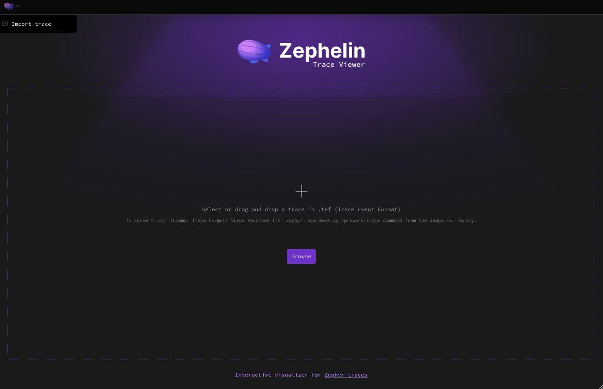
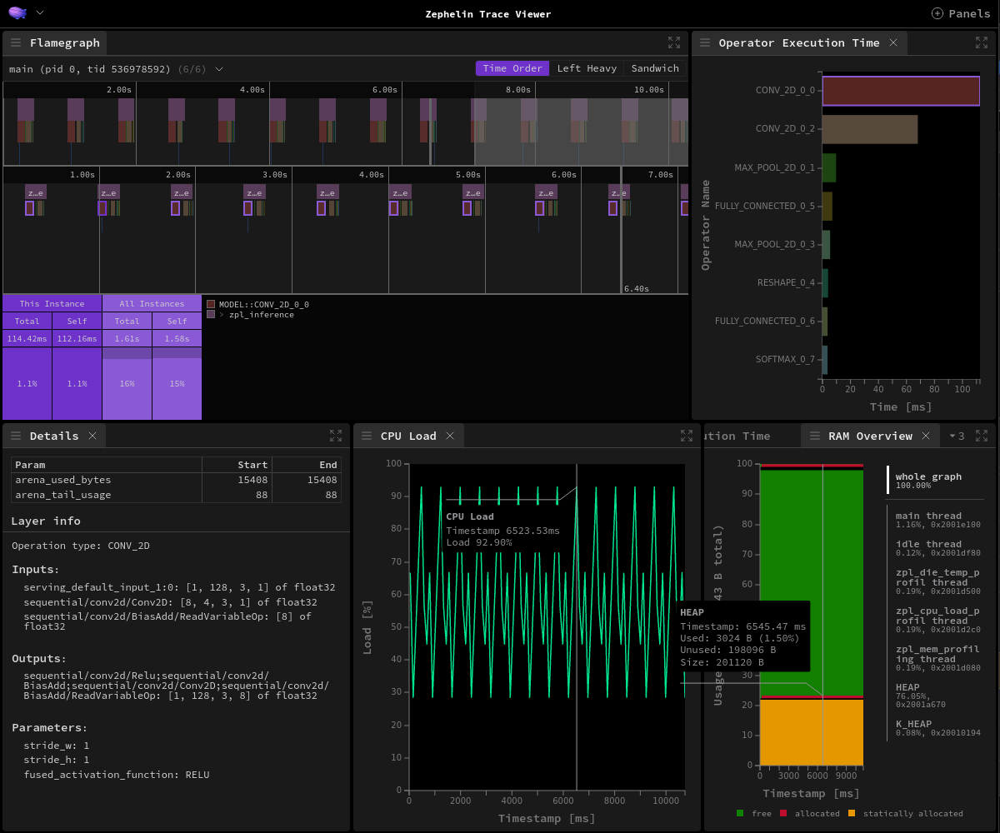

# Zephelin Trace Viewer

Trace Viewer is a visual interface for traces in Trace Event Format (TEF).
To fully utilize features of the viewer, it is suggested to process traces with [CTF converter](./ctf_to_tef.md).

## Requirements

The viewer leverages workspaces to manage a third-party dependencies like Speedscope.
This requires [yarn](https://yarnpkg.com/) in version newer than 1.x, provided by [corepack](https://github.com/nodejs/corepack#readme) (usually installed together with Node.js):
```bash
# Allows to use package managers without having to install them
corepack enable
# Downloads specified version of yarn and all dependencies
yarn
```

## Building

There are a few predefined commands with basic utilities:
- `yarn build` - Builds for production, emitting to `dist/`
- `yarn preview` - Starts a server at http://localhost:4173/ to test production build locally
- `yarn dev` - Starts a dev server at http://localhost:5173/
- `yarn lint` - Lints a code and applies all applicable fixes

## Usage

The viewer is built around [Speedscope](https://github.com/jlfwong/speedscope) - an interactive flamegraph viewer with support for many trace/profiling formats.

:::{figure-md}


The main page of Trace viewer
:::

To display a trace, simply import a TEF file using `Import` (or `Browse`) button.
This action will change the internal state of the Speedscope, which triggers the reaction of `Additional info` section.
It gathers metadata and initializes custom panels based on available data.

### Model info panel

The model info panel displays details about the selected event and the corresponding layer.

Currently, it supports TFLite Micro

:::{figure-md}


The TFLite micro model information example
:::

and microTVM runtime.

:::{figure-md}


The microTVM model information example
:::

### Memory usage panel

The memory usage panel is displayed automatically when memory metadata events are present.
Based on these data grouped by memory type and address, the series of memory usage plots is prepared, as well as a drop-down list allowing user to choose which graph should be displayed.


:::{figure-md}


The memory usage example
:::

```{only} html
## Interactive examples

* <a href="_static/trace_viewer/index.html#profileURL=./tef_tflm_profiler.json">LiteRT runtime example</a>
* <a href="_static/trace_viewer/index.html#profileURL=./tef_tvm_profiler.json">microTVM runtime example</a>
* <a href="_static/trace_viewer/index.html#profileURL=./tef_cpu_load.json">CPU load example</a>
* <a href="_static/trace_viewer/index.html#profileURL=./tef_marking_code_scopes.json">marking code scopes example</a>
* <a href="_static/trace_viewer/index.html#profileURL=./tef_memory_profiling.json">memory profiling example</a>
* <a href="_static/trace_viewer/index.html#profileURL=./advanced.json">combined example</a>
```
